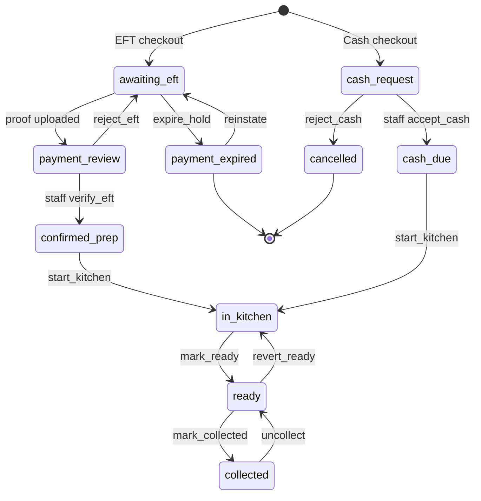
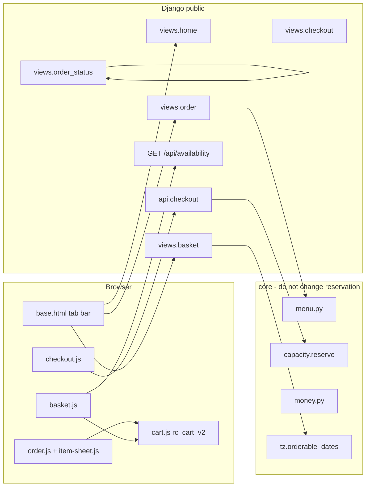
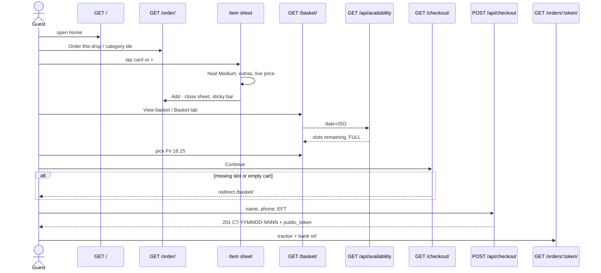

# Roti Connect customer surface — wireframe implementation plan

| Field | Value |
|---|---|
| Document | Implementation plan (customer mobile web rebuild) |
| Author | (engineering) |
| Date | 31 August 2026 |
| Status | Draft |
| Product | Roti Connect — prepaid, capped, collection-only home kitchen (Kraaifontein) |
| Audience | Coding agents (Claude Code, Codex, Grok `/execute-plan`, Cursor) and senior engineers |

This document is executable without the conversation that produced it. Implement the **PR Plan** at the bottom in order. Do not start a greenfield rewrite.

---

## Overview

The live public site is a working Django 5 + vanilla-JS collection-ordering app (no HTMX or Alpine in the tree). Capacity (`src/core/capacity.py`), the status machine (`src/core/transitions.py` + `core.eft`), EFT/cash rules, staff `/manage`, and the `SPEC_v1.1.md` behavioural contract are **in production-shape and must be preserved**. What is wrong is the **customer surface**: IA, copy, visual tokens, and the browse → configure → slot → pay funnel do not match `docs/Roti-Connect-Wireframe-Spec.docx` (readable extract: `docs/_wireframe_spec_extract.md`).

This plan rebuilds the public mobile web so it matches that wireframe spec, while mapping spec labels onto the existing domain (statuses, `CT-YYMMDD-NNNN` order numbers, `POST /api/checkout`, localStorage cart). Staff templates, deploy scripts, capacity ceilings, hold expiry, cash rules, and address-privacy (D-23) are out of scope except for a shared CSS token retune scoped to the public namespace.

---

## Background & Motivation

### Current state

Customer chrome already has a five-item mobile tab bar in `src/templates/base.html` (`Home / Menu / Basket / Account / More`), but:

- **Menu tab** points at crawlable `public:menu` (`/menu/`), not the interactive order surface (`/order/`).
- **Basket tab** points at `public:checkout` (`/checkout/`). There is **no** `/basket/` route.
- `/order/` is D-32's merged screen: text-only dish rows, **day chips + slot grid + cart sheet on the same page** (`src/templates/public/order.html` + `src/static/js/order.js`).
- Home is a dual layout: Broadsheet magazine `.desktop-home` plus a compact `.mobile-home` with empty colour tiles, a search field, and a flyer CTA overlapping the photo (`src/templates/public/home.html`). Hero flyer is a static asset (`src/static/img/roti-connect-advert.jpg`) whose R45 is not bound to a `Dish.price_cents`.
- Item configuration exists only on `/dishes/<slug>/` (`dish_detail.html` + `dish.js`). There is no bottom-sheet overlay on `/order/`. Add on `/order/` writes a bare dish id into `window.BKCart` and **ignores heat/extras**.
- Tracker exists at `/orders/<public_token>/` (`order_status.html`) but is not a five-step visual machine; copy uses kitchen words (`confirmed_prep`, “Awaiting your EFT payment”).
- Account is password login/signup (`public/views.py` `customer_login` / `customer_signup`, `core.Customer.password_hash`). Spec wants OTP-to-mobile.
- Help is a well-written wall of sections, still titled “Brandon's Kitchen”.
- Cart is `localStorage` keys `bk_cart_v1`, `bk_day_v1`, `bk_slot_v1`, `bk_slot_id_v1`, `bk_pay_v1` in `src/static/js/cart.js`. Line shape is `{name, price, qty}` keyed by dish id or `dishId:optId1,optId2`.
- Order numbers are `CT-YYMMDD-NNNN` (`core.ordering.format_order_number`, CHECK `orders_order_number_format`). Spec mockups say `RC-xxxx`.
- Visual identity is Broadsheet (D-30): Source Serif 4, cyan `#0088b0`, magenta `#d6006c`, paper `#f3f2f2`, radius 1–4px (`src/static/css/broadsheet.css`). Spec tokens are Ink/Muted/pink/teal/Paper/Surface, radius 16/999/12, mobile-app not magazine.

### Pain points the spec names

If a live prototype screen disagrees with the wireframe extract, **implement the extract** — except where **this plan** overrides it (KD-3 CT- numbers, KD-6 password not OTP, PR 3 keeps slots until PR 5, lookup refuses `RC-` aliases). Those overrides exist so agents do not invent a second order-number scheme or a fake SMS OTP.

### What is already correct (do not rebuild)

- `POST /api/checkout` → `core.capacity.reserve()` (field validation 400, capacity 422, idempotency).
- EFT hold (`Settings.eft_hold_minutes` default 30), proof upload `POST /api/orders/<token>/proof`, staff payments queue.
- Cash same-day only (`cash_same_day_only`) + `cash_daily_cap`, hidden in `checkout.js` via `window.BK_CASH` when the chosen day is not today or `cash_available` is false. There is **no** separate 00:00–10:00 cash window: after `same_day_cutoff`, today drops out of `orderable_dates`, so cash disappears as a side effect. Offer cash only when `dayIso === today` and `cash_remaining > 0` and `cash_enabled`.
- Horizon: today if open and before cut-off + next 7 days (`core.tz.orderable_dates`, D-05).
- Guest lookup `/lookup/` (`core.lookup.find_order`, last-9-digit match, generic failure, 10/h throttle).
- Reorder `/orders/<token>/reorder/` for `collected` orders (current prices).
- Address only after confirmation (`_ADDRESS_BEARING_STATUSES` in `public/views.py`, D-23).
- Integer cents everywhere (`core.money.format_cents`, `{{ n|cents }}`).

---

## Goals & Non-Goals

### Goals

- Guest path: Home → featured item → configure Medium → add → pick a live slot → name + phone → place EFT → tracker with **real** `order.order_number`.
- Second device recovers via Find my order onto **the same** tracker view.
- After 10:00 SAST, Today is not offered (`orderable_dates` already does this; Basket must consume that list).
- FULL slots visible, not tappable.
- No customer screen shows “Brandon's Kitchen”.
- No empty colour tiles on Home.
- Persistent tab bar on public screens except item sheet and success splash.
- Photos on every sellable item (placeholder if MinIO/`image_media` missing).
- Keep staff `/manage` operational.

### Non-goals (spec §13 + this plan)

- Delivery, card gateway, multi-kitchen, loyalty.
- Desktop magazine layout as a second product (retire `.desktop-home` as the primary experience).
- Staff dashboard rewrite.
- Changing capacity ceilings, hold expiry, cash rules, D-23 address privacy.
- Inventing a second status machine.
- Changing `schema_v1_1.sql` / `orders.order_number` CHECK to `RC-…`.
- OTP/SMS in v1 (adapter is not live; `notifications/` is a stub; `Settings.sms_enabled` defaults false). Logged-out Account must show **mobile + password**, never a dead **Send code** button.
- React/Vue/Tailwind rewrite. Do **not** add HTMX or Alpine for this work.
- Hitting `http://204.168.249.99:8102/` as a dependency (use templates + this plan).

**Screens 1–6 are the product. Screens 7–9 are trust. Do not polish Account before the tracker exists.**

---

## Source of truth (precedence)

1. **This plan** (`docs/ROTI_CONNECT_WIREFRAME_PLAN.md`) — IA, auth, order-number display, cart, tracker labels, PR order. **Overrides the extract** on: no OTP in v1, display `CT-YYMMDD-NNNN` not `RC-xxxx`, refuse `RC-` lookup aliases, keep `/order/` slots until PR 5, route name `/basket/` not SPEC `/cart`.
2. **Customer UI screens / copy / visual tokens** — `docs/_wireframe_spec_extract.md` (do not invent screens; do not start from the `.docx` if the extract exists). Prototype loses to the extract **except** the overrides in (1).
3. **Behaviour, capacity, money, status machine, security, staff ops** — `docs/SPEC_v1.1.md`, `schema_v1_1.sql`, `docs/DECISIONS.md`. Wireframe labels map onto existing statuses; they do not replace them.

When implementing, add **D-35** once (PR 5) to `docs/DECISIONS.md` rather than silently contradicting the log. Do not add a “pending D-35” note in PR 1.

---

## Key Decisions

### KD-1 — Retoken Broadsheet toward the spec; do not restore the dark jewel theme (resolves D-30)

D-30 adopted Broadsheet as the **permanent** identity and forbade reverting to `design/tokens.css` (deleted). The wireframe is a mobile-app surface with different hex, radius, and a sans UI face.

**Ship:** keep Broadsheet's **grammar** (paper ground, Source Serif 4 headings, self-hosted fonts, no CDN, no dark jewel). `body` already gets `route-public` via `class="route-{{ request.resolver_match.namespace }}"` in `base.html`. Under **`body.route-public`**, **add** (these names do **not** exist on `:root` today) and override existing ones:

| Spec token | Hex | Action under `body.route-public` |
|---|---|---|
| Ink | `#1A1A1A` | override `--color-text` (today `#201e1d`) |
| Muted | `#5C5C5C` | **add** `--color-muted`; also override `--color-neutral-600` |
| Accent pink | `#9B1B4A` | override `--color-accent-2` (today `#d6006c`) |
| Accent teal | `#0E5C66` | override `--color-accent` (today `#0088b0`) |
| Paper | `#F6F4F1` | override `--color-bg` (today `#f3f2f2`) |
| Surface | `#FFFDF9` | override `--color-surface` (today `#eae9e9`) |
| Radius | 16 / 999 / 12 | **add** `--radius-card: 16px`, `--radius-pill: 999px`, `--radius-btn: 12px` (do not reuse `--radius-sm/md/lg`, those are 1/2/4px) |

`--font-heading` stays `"Source Serif 4", Georgia, serif`. **Add** `--font-ui: system-ui, -apple-system, "Segoe UI", sans-serif` for tab labels, buttons, chips, field labels. Do **not** vendor Inter unless contrast/metrics fail review (CSP and “no CDN” still apply). Do **not** add HTMX or Alpine.

Staff `/manage` stays on the unscoped `:root` Broadsheet cyan/magenta so kitchen desk contrast does not silently shift. Do not edit staff templates.

Print-plate / CMYK misregistration (`.cmyk-head`, `print-plates.js`) is magazine grammar. Remove it from the **primary** customer Home. Leave the JS include in `base.html` if staff still uses it; unused on public pages is fine.

### KD-2 — Split `/order/`; add `/basket/`; supersede D-32 customer IA (resolves D-32)

D-32 merged menu + day/slot + cart onto `/order/`. Spec routes:

| Spec | Route | Django name |
|---|---|---|
| Home | `/` | `public:home` |
| Menu | `/order/` | `public:order` |
| Item sheet | overlay on `/order/` | no new URL |
| Basket | `/basket/` | **new** `public:basket` |
| Checkout | `/checkout/` (from Basket, not a tab) | `public:checkout` |
| Tracker | `/orders/<public_token>/` | `public:order_status` (spec's `/order/:id` is **not** this app's `/order/`) |
| Find order | `/lookup/` | `public:lookup` |
| Account | `/account/` | `public:account` |
| More | `/help/` | `public:help` |

`/menu/` and `/dishes/<slug>/` remain crawlable permalinks (SPEC §6.1, `robots.txt` allow-list). They are **not** tab destinations. Menu tab → `/order/`. Basket tab → `/basket/` (wireframe name; SPEC §6.1 says `/cart` — **use `/basket/`**, see Alternatives). Desktop header bag icon → `/basket/` after PR 5.

Record as **D-35** in `docs/DECISIONS.md` **in PR 5 only**: D-32's four-screen merge is superseded for the public customer surface; staff kitchen URL unchanged. PR 1 must not add a D-35 stub.

### KD-3 — Order numbers stay `CT-YYMMDD-NNNN` internally and on-screen (resolves RC-xxxx)

Backend CHECK, `format_order_number`, EFT **bank reference**, and lookup all use `CT-YYMMDD-NNNN`. Spec mockups use `RC-1847` as a wireframe label, not a schema.

**v1 ships `CT-YYMMDD-NNNN` as the customer-visible reference.** Tracker heading, EFT ref, share titles, lookup placeholder, and DoD “see reference RC-xxxx” are satisfied by showing the real `order.order_number`. Do **not** mint a second public id. Do **not** change `schema_v1_1.sql`.

Lookup (`core.lookup.normalize_order_number`) today is only `strip().upper()`; `order_number__iexact` will **not** match `CT2609010001` to `CT-260901-0001`. Change it (this module is **not** on the do-not-touch list) to:

- If the stripped input matches `^[Cc][Tt]-?\d{6}-?\d{4}$`, canonicalise to `CT-YYMMDD-NNNN` (insert hyphens).
- Otherwise return the stripped uppercase string and let `find_order` miss (generic fail).
- Do **not** accept `RC-1847` / `rc1847` as an alias (no mapping; collides across days).

Placeholder copy on `/lookup/`: `CT-260901-0001` (never `RC-1847`). Unit tests in `tests/unit/test_lookup.py` (new file) for both hyphenated and compact CT forms, and that `RC-1847` does not canonicalise to a CT number.

### KD-4 — Tracker UI labels map 1:1 onto `OrderStatus`; no second machine

See [Status mapping](#status-mapping-spec-label--real-status). Helper lives in `public/views.py` (extend `_STATUS_COPY`) or a tiny `public/status_ui.py`. **Do not edit `src/core/transitions.py`** except if a later PR truly needs a read-only function; prefer keeping mapping in the public app.

### KD-5 — Cart v2 in `rc_cart_v2`; server checkout field names unchanged; client must start sending `kitchen_note`

See [Cart schema migration](#cart-schema-migration). Server `POST /api/checkout` field names stay `{name, mobile, note, date, slot_id, payment_method, accept_policies, lines:[{dish_id, quantity, option_value_ids, kitchen_note}]}`. Today's `checkout.js` `cartToLines` **omits** `kitchen_note` — PR 4 must add it from the line's `notes`. That is a client adapter change, not a server contract change. Never store the v2 blob under `bk_cart_v1`.

### KD-6 — Keep password session for v1; OTP is a later PR (resolves Account OTP)

`notifications/` is a stub (`# SMS adapter interface … Out of scope`). `Settings.sms_enabled` default false. D-07: SMS optional adapter. Shipping OTP without an adapter would be a fake code.

**v1:** keep `customer_sessions` + password login/signup. Rebuild Account UI to spec layout (Hi {name}, last order, Repeat, saved mobile, logout, guest lookup) **but logged-out chrome is mobile + password + Log in / Sign up**, not “Send code”. Do not render a dead OTP control that agents would then “wire”. Add Repeat last order on Home when `request.customer_user` has a collected order **or** `localStorage` `rc_last_order_v1`. OTP is **out of this PR series**, gated on a real SMS adapter + `sms_enabled`.

Guest checkout remains ungated (SPEC §2.1, spec Account rules).

### KD-7 — Tab bar in `base.html`; hide on item sheet and success splash

Keep the existing `.mobile-bottom-nav` in `src/templates/base.html`. Changes:

- Menu href → `` (not `public:menu`). **PR 1.**
- Basket tab and sticky-bar “View basket” href stay `` through PR 4. **PR 5** adds `public:basket` and retargets both to `/basket/`. Do not introduce a stub URL or a redirect-to-checkout named `basket` in PR 1 — that 404s or double-hops.
- Selected tab uses spec pink (`--color-accent-2`).
- Height 56px + `env(safe-area-inset-bottom)`; page `padding-bottom ≥ 72px`.
- Item sheet (`body.sheet-open`) and checkout success splash hide the tab bar (`hidden` / class). `/manage` already omits it (`namespace == 'public' and not staff_user`).
- Desktop (≥760px): same flow, wider. Compact top wordmark + the same five destinations as text links. Do **not** restore Broadsheet icon-only Order/Checkout as the primary IA.

### KD-8 — Item sheet is an overlay, not a new Django page

In-flow UI is a bottom sheet on `/order/` and `/basket/` (`src/templates/public/_item_sheet.html` + `src/static/js/item-sheet.js` + shared `#menu-data`). `/dishes/<slug>/` stays as progressive-enhancement permalink (WhatsApp/IG) and can reuse the same modifier markup/JS. Whole card and `+` both open the sheet.

### KD-9 — Featured drop, chip map, and “from” prices (no `this-week` category in DB)

Wireframe sample data (Chicken roti R45, tiles from R65/R95/…) is **illustrative**. `seed_dev._DEV_DISHES` has no “Chicken roti (drop)” at R45; chicken masala roti roll is R65. **Never hardcode R45.** Hero price = `featured.price_cents`. Category tile `from` = min `price_cents` among active dishes whose DB `category` is in that chip's set.

**Chip → DB `Dish.category` (exact strings in seed):**

| Chip | `Dish.category` values |
|---|---|
| All | unique `dish.id` in `sort_order` (each dish once) |
| This week | featured slug plus Home picks slugs: `chicken-masala-roti-roll`, `full-house-masala-steak-gatsby`, `beef-lasagne` (intersection with `is_active_on_menu`, unique by `dish.id`) |
| Roti | `Masala Roti Rolls`, `Roti & Curry`, `Roti & Gatsby, Large` |
| Gatsby | `Gatsby`, `Roti & Gatsby, Large` |
| Curry | `Roti & Curry` |
| Lasagne | `Italian Lasagne` |

A dish in two **named** chips (e.g. Chicken Curry & Roti under Roti **and** Curry; Roti & Gatsby under Roti **and** Gatsby) **may repeat as a card in each of those sections**. **All** and **This week** never duplicate: unique `dish.id`. Do not invent a `this-week` category column. Do not concatenate Roti+Gatsby+Curry+Lasagne to build All (that would list dual-category dishes twice).

**Featured (Home hero, `?featured=`):** if `?featured=<slug>` and that dish is active, use it; else `chicken-masala-roti-roll` if active; else the first `is_active_on_menu` dish by `sort_order`. There is no `this-week` category to scan.

**Hash deep-links:** `/order/#gatsby` sets the Gatsby chip selected and `document.getElementById("section-gatsby").scrollIntoView()`. Each section wrapper gets `id="section-roti"` / `section-gatsby` / `section-curry` / `section-lasagne` / `section-this-week`. Unknown hash → All.

### KD-10 — “I've paid” is proof upload, not a confirm transition

Spec: notifies kitchen, does not mark confirmed. That is existing `POST /api/orders/<token>/proof` → `payment_review`. Relabel the control to **I've paid** (file picker still required — a notify-without-file would be a new transition; out of scope). WhatsApp link already exists when `support_whatsapp_e164` is set.

### KD-11 — Desktop is the mobile flow at a wider max-width

Remove the dual `.mobile-home` / `.desktop-home` split as the product. One column, `max-width: 640px` (Home/Menu/Basket/Checkout/Tracker), centered on large screens. Do not ship a second magazine.

---

## Status mapping (spec label → real status)

Customer tracker shows **five dots** (Held / Confirmed / Cooking / Ready / Collected) plus terminal copy for released/cancelled. Internal machine is `core.models.OrderStatus`.

| Spec UI label | Real `OrderStatus` | Customer copy | Tracker dot |
|---|---|---|---|
| held | `awaiting_eft` | Held — waiting for EFT | ● Held |
| (held, proof in) | `payment_review` | Held — we're checking your payment | ● Held (subcopy) |
| pending_staff | `cash_request` | Waiting for the kitchen to accept | ● Held (cash) |
| confirmed | `confirmed_prep` | Confirmed | ● Confirmed |
| confirmed (cash accepted) | `cash_due` | Confirmed — bring cash at collection | ● Confirmed |
| cooking | `in_kitchen` | Cooking | ● Cooking |
| ready | `ready` | Ready · {slot} | ● Ready |
| collected | `collected` | Collected | ● Collected |
| released | `payment_expired` | Slot released — EFT not paid in time. Re-order. | terminal; CTA Re-order → `/order/` |
| cancelled | `cancelled` | Cancelled. See Help. | terminal |

Do not create `held`, `pending_staff`, `cooking`, or `released` rows. Address still follows `_ADDRESS_BEARING_STATUSES` = `{confirmed_prep, cash_due, in_kitchen, ready}` (SPEC §9.1 / D-23). EFT bank panel stays on `{awaiting_eft, payment_review}`.

**Five-dot fill algorithm** (put in new `src/public/status_ui.py`; templates call it; **do not** edit `transitions.py`):

```
STEPS = ["Held", "Confirmed", "Cooking", "Ready", "Collected"]

def current_index(status: str) -> int | None:
    # None => terminal; replace the stepper with released/cancelled copy
    if status in (OrderStatus.AWAITING_EFT, OrderStatus.PAYMENT_REVIEW, OrderStatus.CASH_REQUEST):
        return 0  # Held
    if status in (OrderStatus.CONFIRMED_PREP, OrderStatus.CASH_DUE):
        return 1  # Confirmed
    if status == OrderStatus.IN_KITCHEN:
        return 2
    if status == OrderStatus.READY:
        return 3
    if status == OrderStatus.COLLECTED:
        return 4
    return None  # payment_expired | cancelled
```

Dots `0..current_index` are filled. **Later steps stay filled when the order is further along** (`in_kitchen` fills Held + Confirmed + Cooking). After `reject_eft` (`payment_review → awaiting_eft`), `reinstate`, `revert_ready`, or `uncollect`, recompute from the **current** `order.status` only — the mermaid below is not the full matrix; the customer UI does not need those arrows, it needs to render whatever status the row has.

**Hold-lapsed (D-09):** `payment_review` never auto-expires. If `status == payment_review` and `hold_expires_at < now`, still `current_index = 0` (Held), copy = “Held — we're checking your payment (the 30-minute hold clock has lapsed; your proof is still with us).” Distinct from `payment_expired` (released).

**Replace** `_STATUS_COPY` in `views.py` with the strings from this table / `status_ui.py`. Do not layer a second dictionary on top of the kitchen English.

**Refresh:** full page load is enough. Optional `<meta http-equiv="refresh" content="30">` on non-terminal tracker pages so staff verify moves the dots without a new channel. No websocket.

Customer-visible happy path (not the full §9.1 matrix — `reject_eft`, `reinstate`, `revert_ready`, `uncollect` still land on a real `OrderStatus` and the stepper uses `current_index` above):



---

## Proposed Design

### Screen → current code → target

| Screen | Route now | View | Template | JS | Target |
|---|---|---|---|---|---|
| Home | `/` | `views.home` | `public/home.html` | none | Rebuild mobile-app Home; drop magazine as primary |
| Menu (interactive) | `/order/` | `views.order` | `public/order.html` | `order.js` | Browse + chips + cards + sheet + sticky bar; **no** day/slot |
| Menu (crawlable) | `/menu/` | `views.menu` | `public/menu.html` | — | Keep; not a tab |
| Dish permalink | `/dishes/<slug>/` | `views.dish_detail` | `public/dish_detail.html` | `dish.js` | Keep; share sheet markup with overlay |
| Item sheet | missing | — | **new** `_item_sheet.html` | **new** `item-sheet.js` | Overlay on `/order/` **and** `/basket/` (same partial + `#menu-data`) |
| Basket | missing (tab → checkout) | **new** `views.basket` | **new** `public/basket.html` | **new** `basket.js` + `item-sheet.js` | Lines + steppers + day + slots + Edit sheet |
| Checkout | `/checkout/` | `views.checkout` | `public/checkout.html` | `checkout.js` | Redirect if no slot; fulfilment first; no empty Collect |
| Tracker | `/orders/<token>/` | `views.order_status` | `public/order_status.html` | `eft.js`, `share-link.js` | Five-step machine + I've paid |
| Find order | `/lookup/` | `views.lookup` | `public/lookup.html` | — | Same view on success; visual retune |
| Account | `/account/` + login/signup | `views.account` etc. | `account.html`, `customer_login.html`, `customer_signup.html` | — | Repeat last order; password v1 |
| Reorder | `/orders/<token>/reorder/` | `views.reorder` | `public/reorder.html` | `BKCart.setState({ lines, slotId: null, slotLabel: null })` | Land on `/basket/` with slot unselected |
| Help | `/help/` | `views.help_page` | `public/help.html` | — | Four cards; live Settings figures |
| Policies | `/policies/` | `views.policies_page` | `public/policies.html` | — | Keep facts; Roti Connect title |

### Architecture (customer request path)



### Primary journey



### New `/basket/` — what moves off `/order/`

**Moves to Basket**

- Day chips currently `#op-day-chips` / `order.js` `renderDayChips` / `BKCart.getDayIso` / `setDayIso` (PR 4 already dropped the integer `getDay()` index).
- Slot grid `#op-slot-grid` / `_slot_list_for_day` / `getSlot` + `getSlotId`.
- Order sheet steppers (qty − / +), line Edit, Continue CTA, empty-cart state, subtotal.
- Continue disabled unless `cartCount > 0` **and** a non-full slot is selected.

**Stays on `/order/`**

- Category chips (sticky), dish cards with photos, item sheet, sticky basket bar (“N items · Rxx View basket”).
- Sold-out treatment.

**Today's bug to fix on move:** `_slot_list_for_day` only loads the **soonest** orderable day's slots and only returns `{id, label, full}` — “12 left” cannot be built from that payload; changing day does not refetch (`views.order` docstring). Basket **must** refetch per selected ISO via `GET /api/availability?date=` (SPEC §17.3; currently unimplemented). Implement a **read-only** JSON endpoint in `public/api.py`.

**Frozen JSON** (`GET /api/availability?date=YYYY-MM-DD`, no trailing slash):

```json
{
  "date": "2026-09-04",
  "slots": [
    {"id": 12, "label": "16:15", "capacity": 13, "occupying": 1, "remaining": 12, "closed": false, "full": false}
  ],
  "cash_remaining": 4,
  "cash_offered": true,
  "dishes": [
    {"id": 41, "remaining": null, "sold_out": false}
  ],
  "day_remaining": 76,
  "day_sold_out": false
}
```

Rules:

- Missing/unparseable `date` or date outside `orderable_dates` → **400** `{ "error": "outside_horizon" }` (Appendix C name). Not 404.
- `materialise_days` is write-on-read (already used by `views.order`). Acceptable here.
- Occupying count: `Order.objects.filter(slot=s, status__in=OCCUPYING_STATUSES).count()` — **copy the query**, do not call `check_slot_cap` / `check_day_cap` (`check_day_cap` **raises** `CapacityError` when full and would 500 a GET).
- `remaining = max(0, slot.capacity - occupying)`; `full = closed or remaining == 0`.
- `cash_offered` = `cash_enabled` and (`date == today`) and `cash_remaining > 0` (and `cash_same_day_only` already implies date==today).
- `dishes[]`: for each active dish that day, `remaining` is `null` when uncapped (`DayDishAvailability` absent or `max_units` null); else `max(0, max_units - dish_units_used)`; `sold_out` matches `menu.dishes_for_date`.
- `day_remaining = max(0, trading_day.daily_order_cap - occupying_day_count)`; Home “Sold out edition” badge uses this read, **never** `check_day_cap`.

Same-day tab hidden after cut-off because it is absent from `orderable_dates` (already). FULL slots: `disabled` + visible.

Empty Basket copy (spec): “No order yet / Friday's menu is short. Start with the chicken roti. / See the menu” — use featured dish name from context, not a hardcoded “chicken roti” if that slug is absent.

**Basket Edit:** PR 5 **includes** `_item_sheet.html` + `item-sheet.js` on `basket.html`. Edit calls `BKCart.updateLine` in **update mode** (`Update · R{live}`), does **not** navigate to `/order/?edit=`. Steppers ± stay on the row.

A cart line's denormalised `heat` / `extras` / `optionValueIds` is enough to **display** the row, **not** enough to switch Medium→Hot or add Extra roti (unselected value PKs live on the dish, not the line). Therefore `views.basket` must emit the **same** `#menu-data` island as `/order/` (see Item sheet behaviour). Do **not** add `GET /api/menu` in this series.

### Item sheet behaviour

**Shared catalog island** (`id="menu-data"`, `json_script`): list of

`{id, slug, name, price_cents, portion_label, short_description, photoUrl, sold_out, options:[{id, name, required, values:[{id, name, price_delta_cents, is_available}]}]}`.

Helper `public.views._menu_catalog_payload(trading_day) -> list[dict]` calls `dishes_for_date(..., with_options=True)` and attaches `photo_url`. Used by **`views.order` and `views.basket`** (basket uses the soonest orderable day, same as today's order screen, so sold-out flags are edition-scoped; option PKs/deltas do not vary by date). `views.order` already fetches options but does not emit them — PR 4 emits `#menu-data` on `order.html`; PR 5 emits the same island on `basket.html`. Cards may still use `.op-dish-row` data-* for add; the sheet **always** looks up `itemId` in `#menu-data`.

`item-sheet.js`: `open({ itemId, lineId? })`. If `itemId` is missing from the island or `sold_out`, disable Add/Update and show “This dish is not on this week's menu.” Do not invent `GET /api/menu`.

Modifier rules:

- **DB group name stays `Spice`** (SPEC glossary / `option_key` / `tests/unit/test_ordering.py` / `dish_options_dish_name_uniq`). The sheet **labels** that group **Heat** in copy (presentational map only). Do **not** rename Spice→Heat (reorder rematches `(option name, value name)` and would drop historical lines; a second required group would block Add).
- Seed today attaches Spice (Mild/Medium/Hot, 0 delta, required) **only** on `full-house-masala-steak-gatsby`. PR 4 `seed_dev` must add the same Spice group to roti rolls, gatsbys, and curry dishes (including featured `chicken-masala-roti-roll`) so DoD “configure Medium” works. Lasagne: no Spice group. After seed, Full House still has **exactly one** required group (assert in a seed or menu test).
- Extra roti (`No` default / `Yes` `price_delta_cents=1200`) and Chips (`With chips` 0 / `No chips` `-500`) seed only on dishes whose description already includes chips (roti rolls, gatsbys). Hide the group when the option row is absent (lasagne, curry plates).
- If a dish has no Spice option, hide the Heat chips — do not invent values client-side. `reserve()` does **not** enforce required options; the sheet must.
- Notes max 80 chars → `kitchen_note` on the checkout line (API allows 200; client caps 80). Today's `cartToLines` omits it; PR 4 sends it.
- Live button: `Add · R{live}` / `Update · R{live}` using `BKCart.rands` (integer cents).
- Backdrop / X dismisses without add. Do not auto-navigate to Basket.
- Toast “Added · View basket”.
- Production dishes are staff-editor data: add a bullet on `docs/GO_LIVE_PREP_SHEET.md` §01 that every roti/gatsby/curry row must have Spice (Mild/Medium/Hot) plus extras where relevant, or the Medium demo cannot be shown on prod.

### Persistent tab bar + sticky basket bar

Sticky basket bar: visible on Menu (and Home if `cartCount > 0`). Position `bottom: calc(56px + env(safe-area-inset-bottom) + 8px)`. Label `{n} item(s) · {rands} View basket`. Implemented in `cart.js` `refreshHeader()` plus a `#sticky-basket-bar` in `base.html`. **Href:** `` until PR 5; PR 5 switches the same element to ``. Do not point it at `/basket/` in PR 3/4.

### Photos

`Dish.image_media` → `core.Media`. Staff `store_dish_image_bytes` writes `dish-images/<uuid>.<ext>` to MinIO bucket `S3_BUCKET_PUBLIC` (`curry-media`) or `MEDIA_ROOT` when `S3_ENDPOINT` is blank. Public templates ignore `image_media`. There is **no** `public_dish_image_url()` today; `signed_proof_url()` is proofs-only and raises without S3. `config/urls.py` does **not** serve `MEDIA_ROOT`. `MenuDish` has no `photo_url`. Do **not** HEAD MinIO per card.

**PR 2 constructs URLs** (`storage.service.public_dish_image_url(storage_key: str) -> str`):

1. If `settings.CDN_BASE_URL` set → `{CDN_BASE_URL.rstrip("/")}/{storage_key}`.
2. Elif `settings.S3_PUBLIC_ENDPOINT` set → `{S3_PUBLIC_ENDPOINT.rstrip("/")}/{S3_BUCKET_PUBLIC}/{storage_key}`.
3. Else → `"/" + settings.MEDIA_URL.strip("/") + "/" + storage_key` (today `MEDIA_URL` is `"media/"` without a leading slash — the helper must still emit `/media/dish-images/…`).

If `image_media` is null, `photo_url` is `""`.

**DEBUG local files:** in `config/urls.py`, when `DEBUG`, append `static(settings.MEDIA_URL, document_root=settings.MEDIA_ROOT)` (`django.conf.urls.static`). Prefer fixing `MEDIA_URL` to `"/media/"` in `settings/base.py` if `static()` requires a leading slash — keep tests that join paths working.

**`MenuDish`:** add `photo_url: str` populated in `dishes_for_date` / a small helper used by `views.home` from `dish.image_media.storage_key`. Home tiles reuse it.

**Broken images:** `` plus CSS placeholder (paper surface + initial). Never hide the card. Never server-side GET the object to detect 404.

**CSP:** `config/security_headers.py` already puts `CDN_BASE_URL` and `S3_PUBLIC_ENDPOINT` hosts on `img-src`. No CSP change unless a new host is introduced. Local `/media/` is `'self'`.

- Home category tiles: representative dish image per chip (first dish in that chip set with `photo_url`, else placeholder). Never empty colour blocks.
- Hero: featured `photo_url`; flyer asset `roti-connect-advert.jpg` only as fallback and **must not** cover location text. CTA **under** the photo.

### Menu data vs `DISH_LIST_DRAFT.md`

| Spec table (illustrative) | seed_dev slug | seed price |
|---|---|---|
| Chicken roti (drop) R45 | **not seeded** | — |
| Chicken masala roti roll R65 | `chicken-masala-roti-roll` | 6500 |
| Steak masala roti roll R70 | `steak-masala-roti-roll` | 7000 |
| Chicken curry & roti R85 | `chicken-curry-roti` | 8500 |
| Steak curry & roti R95 | `steak-curry-roti` | 9500 |
| Chicken masala gatsby R95 | `chicken-masala-gatsby` | 9500 |
| Steak masala gatsby R100 | `steak-masala-gatsby` | 10000 |
| Full house steak gatsby R130 | `full-house-masala-steak-gatsby` | 13000 |
| Chicken roti & gatsby R110 | `chicken-masala-roti-gatsby` | 11000 |
| Steak roti & gatsby R115 | `masala-steak-roti-gatsby` | 11500 |
| Beef lasagne R90 | `beef-lasagne` | 9000 |

Do **not** silently insert a R45 drop dish. Owner input (`GO_LIVE_PREP_SHEET.md` §01) is blocking for go-live photos/prices. Engineering uses live `Dish` rows. Chip map is KD-9 (not a schema change). Deep link `/order/#gatsby` and `?featured=chicken-masala-roti-roll`.

Gatsby “Serves 4” must **not** be a category heading; it is `portion_label` on the card (`order.html` currently copies `dishes.0.portion_label` onto the category head — **remove that**).

### Edition / featured / cut-off copy

Computed, not hardcoded:

- Next edition label: first `orderable_dates` entry → “Fri 4 Sep” via existing `_DAY_NAMES` / `_MONTH_NAMES` in `views.py`.
- Window: `Settings.default_window_start/end` (or that trading day's window if customised) — already `collection_window` on Home.
- Cut-off line: if today is still orderable, “Order by {today} {cutoff}”; else “Ordering for {next Friday-like label}” / CTA “Order for {next}”.
- Sold-out edition: if `day_remaining == 0` on the next edition day (occupying count vs `daily_order_cap`, same formula as availability JSON). **Do not call** `capacity.check_day_cap` (it raises). Do not call `reserve`.
- Collection chip sheet: suburb **Kraaifontein**, window, cut-off, no-hooting. **No street address** (D-23) until tracker in address-bearing statuses.

### Checkout changes

`checkout.js` already requires cart + slot; Collect shows `—` if missing. Spec: **redirect to Basket** if Collect/Window empty. After PR 5: `if (!getSlotId() || totals().count===0) location = /basket/`.

Place order disabled until name (2–80), valid SA mobile (`normalize_sa_mobile` already on API), pay method, live slot — enable client-side to match API.

Fulfilment block **above** pay options. EFT 30-min copy on this screen (already in `ck-pay-desc` via `eft_hold_minutes`). Cash hidden when day ≠ today or `cash_available` false (already).

On 201: clear cart, **navigate to tracker immediately** (drop 1.8s in-page splash, or keep a tab-bar-free splash <400ms). Success must not land on Home/empty basket.

On 422 `slot_full`: send user back to Basket with message “Slot no longer available”; that slot marked FULL (toast, not a blocking modal).

Keep `accept_policies` (API requires it; spec wireframe omits it — **behaviour wins**, keep the checkbox, style it quietly).

Share title: “Roti Connect — order {order_number}” (`checkout.js` line ~306, `order_status.html` line ~214).

`cartToLines` must send `kitchen_note` from each v2 line's `notes` (server already accepts it on `CheckoutLine`; the current client does not send it).

### Tracker + lookup

- Heading `Order {{ order.order_number }}` (CT-…).
- Five-step list using KD-4 mapping.
- Bank details + Copy ref + hold until `hold_expires_at` (existing `#os-eft-countdown`).
- I've paid = proof upload (KD-10).
- Lookup success already `redirect("public:order_status", ...)`. Restyle lookup; placeholder `CT-260901-0001`. Failure copy stays generic (`_LOOKUP_GENERIC_ERROR`) — SPEC §11.10 / existing tests forbid leaking existence. Do not “fix” the placeholder back to `RC-1847`.

### Account + Repeat

- Logged-out: mobile + password (existing `customer_login` / `customer_signup`), copy “Save details and repeat last Friday's order”, plus guest lookup link. **No Send code button**, even disabled. Optional: single page combining login fields.
- Logged-in: last collected order for `request.customer_user` (query `Order.objects.filter(customer=..., status=collected).order_by('-collected_at')[:1]`). Repeat → existing `reorder` view, then **Basket** not `/order/` for slot pick (`reorder.html` CTA).
- Guest Repeat: `rc_last_order_v1` `{publicToken, summary}` set on checkout success; Home module links to `/orders/<token>/reorder/` only if we also have the token (guest has it after checkout). Without token, hide Repeat.

### Help

Four cards, live Settings: cut-off + `preorder_days`; window + `slot_minutes`; EFT hold + cash same-day; Kraaifontein + text on arrival (no street). Policies + WhatsApp links. One-liners reused as partial `public/_how_it_works_oneline.html` on Home and Checkout.

---

## Cart schema migration

**Today** (`cart.js`): `getCart()` returns `{ [id]: { name, price, qty } }`. `totals()` does `Object.keys(cart).forEach`. `order.js` and `checkout.js` `parseLineKey` / `cartToLines` treat keys as `dishId` or `dishId:optIds`. **If PR 4 writes the v2 blob into `bk_cart_v1` or makes `getCart()` return `{lines, dayIso, ...}` raw, the header badge, order sheet, and checkout payload all break** (keys become `"lines"` / `"dayIso"`, `qty` undefined).

**Storage (frozen):**

| Key | Contents |
|---|---|
| `rc_cart_v2` | `{ version: 2, lines: [...], dayIso, slotLabel, slotId, pay }` |
| `bk_cart_v1` and `bk_day_v1` / `bk_slot_v1` / `bk_slot_id_v1` / `bk_pay_v1` | **read-only migration source**. Never write v2 into `bk_cart_v1`. Delete old keys on successful checkout `clearCart`. |

Line object:

```js
{
  id: "41:3,9",           // stable: dishId + sorted optionValueIds (not a random uuid)
  itemId: 41,             // Dish.pk
  name: "Chicken masala roti",
  heat: "Medium",         // denormalised Spice value label
  extras: [{ optionValueId: 9, name: "Extra roti", deltaCents: 1200 }],
  notes: "",
  qty: 1,
  unitPrice: 7700,        // cents
  lineTotal: 7700,
  photoUrl: "/media/...",
  optionValueIds: [3, 9]  // Spice Medium + extra roti PKs — source of truth for API
}
```

**Frozen `window.BKCart` surface (PR 4 lands cart.js + order.js + checkout.js + dish.js + reorder.html + item-sheet.js together):**

| Method | Contract |
|---|---|
| `getState()` | v2 object `{ lines, dayIso, slotLabel, slotId, pay }` |
| `setState(partial)` | merge + persist `rc_cart_v2` + `refreshHeader` |
| `getLines()` | `getState().lines` |
| `upsertLine(line)` | match `itemId` + sorted `optionValueIds` + `notes` → increment `qty`; else push. Recompute `lineTotal`. |
| `updateLine(id, patch)` | Basket/sheet update mode; recompute `unitPrice`/`lineTotal` if extras change |
| `removeLine(id)` | drop line |
| `clearCart()` | `lines = []`; keep or clear day/slot per caller |
| `totals()` | `{ count: sum(qty), total: sum(qty * unitPrice) }` over **`getLines()`**, never `Object.keys(getCart())` |
| `getDayIso` / `setDayIso` / `getSlot` / `setSlot` / `getSlotId` / `setSlotId` / `getPay` / `setPay` | persist inside v2 |
| `rands` / `refreshHeader` | unchanged behaviour (badge = `totals().count`) |
| `getCart` / `setCart` / `setLine` / `bump` / `getDay` / `setDay` | **removed** in PR 4 (no dual map API, no day **index**). Migration reads `bk_cart_v1` once inside `getState()` bootstrap. Do **not** turn `bk_day_v1` (an index) into `dayIso` — leave `dayIso` null until the user picks a chip (`getDayIso()`). |

**Migration on first `getState()`:** if `rc_cart_v2` missing and `bk_cart_v1` present, convert each map entry → one line (`itemId` / `optionValueIds` from the old key via today's `parseLineKey` logic, `unitPrice=price`, `lineTotal=price*qty`, `heat/extras/notes/photoUrl` empty, `id` = old key). Write `rc_cart_v2`. Copy `bk_slot_id_v1` / `bk_slot_v1` / `bk_pay_v1` into v2 fields. **Do not** map `bk_day_v1` (integer index) to `dayIso`.

**checkout.js `cartToLines` (replace `parseLineKey` on object keys):**

```js
function cartToLines() {
  return window.BKCart.getLines().map(function (l) {
    return {
      dish_id: l.itemId,
      quantity: l.qty,
      option_value_ids: l.optionValueIds || [],
      kitchen_note: (l.notes || "").slice(0, 80)
    };
  });
}
```

**reorder.html:** stop calling `setCart(map)`. Emit v2 `lines[]` JSON and call `BKCart.setState({ lines: ..., slotId: null, slotLabel: null })`.

**Tests:** PR 4 must include a pytest that builds a v1 localStorage-shaped payload through the same `cartToLines` logic (or a small Python mirror / Playwright) and asserts the POST body has `dish_id`, `option_value_ids`, and `kitchen_note`. `tests/integration/test_checkout_api.py` remains the server contract (already allows `kitchen_note`).

Day: persist `dayIso`; Basket maps iso → chip. Stop persisting raw index as the only key.

---

## API / Interface Changes

| Endpoint | Change |
|---|---|
| `POST /api/checkout` | **No server field-name change.** Client starts sending per-line `kitchen_note`. |
| `POST /api/orders/<token>/proof` | **No contract change.** Tracker button label only. |
| `GET /api/availability?date=` | **New.** Frozen JSON in Proposed Design. CSRF not required (GET). 400 `outside_horizon`. |
| `GET /api/menu` | **Do not add** in this series. Menu catalog is the `#menu-data` `json_script` on `/order/` and `/basket/`. |
| `GET /basket/` | **New** HTML view. |
| `GET /order/` | HTML: no slot panel (after PR 5); emit options JSON + photo URLs. |
| `GET /checkout/` | JS (and optionally server) 302 to `public:basket` when cart or `slotId` missing. |

```python
# public/api.py
@require_GET
def availability(request):
    ...
```

URL: `path("api/availability", api.availability, name="api_availability")` — no trailing slash, same as checkout.

---

## Data Model Changes

**No `schema_v1_1.sql` change for v1.**

Optional non-schema work:

- Seed **Spice** (not a group named Heat) + Extra roti + Chips on the right dishes (`seed_dev.py` only). Production dishes via staff menu editor + go-live sheet note.
- `Settings.public_site_name` default/seed → `"Roti Connect"` (`seed_dev.py`). Staff settings tests that POST `"Brandon's Kitchen"` as a **form value** may stay (they test the editor, not customer chrome).
- Dish photos remain `dishes.image_media`. Add `public_dish_image_url` in `storage.service` (no new column).
- `MenuDish.photo_url` is a dataclass field, not a DB column.

If a future owner insists on `RC-` display ids, that is a **new** nullable column + migration + dual write — explicitly **not** this plan.

---

## Brand string hunt (customer chrome)

Replace in **public** templates and public JS only (staff titles may stay until a staff polish PR; spec says customer chrome):

| File | Current |
|---|---|
| `src/templates/public/*.html` `` | `— Brandon's Kitchen` |
| `src/templates/public/help.html` intro | “at Brandon's Kitchen” |
| `src/templates/public/order_status.html` share title | `Brandon's Kitchen — order …` |
| `src/static/js/checkout.js` share title | same |
| `src/templates/public/home.html` footer note | “finalised with Brandon” (prototype disclaimer — rewrite or remove) |
| `src/templates/public/order.html` | “Sample menu & pricing — for review” — **remove** (spec: sample banner only at `?preview=1`) |
| `src/staff/management/commands/seed_dev.py` | `public_site_name` default |
| Tests asserting `b"Brandon"` on Home | `tests/integration/test_screens.py` `TestHome.test_renders_with_no_settings_row` |

Do not rewrite `updates/…/design_handoff_brandons_kitchen/` (historical). PR 4 adds a short Spice/photos bullet to `docs/GO_LIVE_PREP_SHEET.md` §01 only.

`base.html` wordmark already says Roti Connect. Home title already “Roti Connect — home kitchen, collection only”.

---

## Alternatives Considered

### 1. Rebuild as a React/Vue SPA vs stay Django templates + vanilla JS

- **SPA:** matches “app” feel; fights the repo (D-13 named Django + templates, CSP `script-src 'self'`, no bundler in-tree). Would reimplement checkout/CSRF/idempotency at high risk to `reserve()`.
- **Chosen:** stay Django templates + vanilla JS (`cart.js` pattern). New pages are templates; new behaviour is small IIFEs. **Do not add HTMX, Alpine, React, or Vue** — none of them are in public templates/JS today.

### 2. Keep full Broadsheet magazine vs spec tokens vs revert dark jewel

- **Full Broadsheet:** D-30 letter; fails spec (radius, tab-bar app, pink/teal, CTA-under-photo).
- **Dark jewel:** explicitly forbidden by D-30.
- **Chosen:** KD-1 scoped retoken. Headings stay serif; UI sans; public palette = spec.

### 3. Item sheet as `/dishes/<slug>/` vs overlay

- **Page:** already built (`dish.js` options + add). Extra navigation on a 10-item menu; spec forbids a full-page product route as the in-flow UI.
- **Chosen:** overlay. Permalink page remains for sharing.

### 4. Change order numbers to `RC-xxxx`

- Breaks CHECK constraint, bank recon, staff muscle memory, `format_order_number`, every test fixture.
- **Chosen:** KD-3 keep `CT-YYMMDD-NNNN`.

### 5. OTP now vs password

- OTP matches spec but requires SMS (not live). Fake in-browser codes are a security defect.
- **Chosen:** KD-6 password + Repeat + guest lookup; OTP later.

### 6. Wireframe `/basket/` vs SPEC §6.1 `/cart` vs D-32 merge

- SPEC §6.1 lists `/cart`. The wireframe (this rebuild's UI SoT) lists `/basket/` as a tab. D-32 merged cart onto `/order/` and never created either route.
- **Chosen:** `/basket/` as in the wireframe. D-35 records that it supersedes both D-32's merge and SPEC's `/cart` path name. Do not also register `/cart/` as an alias (two URLs for one screen). Keep `/checkout/` as the post-basket step, not a tab.

---

## Security & Privacy Considerations

| Topic | Rule |
|---|---|
| Address (D-23) | Never on Home, Menu, Basket, Checkout, Help cards, OG, sitemap. Only tracker in `_ADDRESS_BEARING_STATUSES`. Collection chip may say Kraaifontein + no-hooting, not the street. |
| Lookup | Keep generic error; last-9 match; 10/h throttle (`core.lookup`). Spec's distinct failure sentence would leak existence — **wontfix vs spec copy**. |
| Checkout | CSRF + `Idempotency-Key`; rate limit 5/min/IP (D-21) unchanged. |
| Proof | Existing magic-byte validation, 8 MB, 5/h/token. I've paid must not skip this. |
| Cart | localStorage only; no new PII. “Save on this phone” = name/mobile in localStorage, not a new server store. |
| OTP | Not in v1 — avoids storing codes without SMS. |
| Staff | `/manage` unchanged; footer Staff login stays low-key. |
| CSP | No external CDNs; self-hosted fonts only. |
| `robots.txt` | Add `Disallow: /basket/`. Keep `/order/`, `/checkout/`, `/orders/`, `/lookup/` disallowed. |

Threat: availability GET is public optimistic data (remaining counts). Acceptable (SPEC already publishes this). Do not return customer names.

---

## Observability

- Existing Sentry (`sentry-sdk`). No new service.
- Log `GET /api/availability` 4xx (bad date) at info; 5xx at error.
- Checkout already returns Appendix C codes; Basket should surface `slot_full` message from checkout 422.
- Metrics (if any existing request logging): add `/basket/` to public routes. No new dashboards required for this UI rebuild.
- Alerting: unchanged (hold expiry job, healthz).

---

## Rollout Plan

1. Land PRs 1–9 on `main` in order; prototype host (Clawsrv :8102) deploys as today (`docs/DEPLOYMENTS.md`).
2. Feature flags: not required for templates. Optional `?preview=1` to show the old sample banner for the owner only (spec).
3. Cart migration is backward compatible (read v1, write v2).
4. Rollback: revert the public template/JS PR; `capacity.py` / schema untouched so rollback cannot corrupt orders.
5. Staff can take orders via `/manage` throughout.
6. After PR 6, smoke an EFT order on the prototype and confirm staff inbox still sees `awaiting_eft`.

Load: unchanged (~100 orders/day cap). LCP: hero image + serif font already in budget (SPEC §17.5); extra dish thumbs must be compressed (staff upload path already 5 MB cap). Latency: availability GET should stay <100 ms on local Postgres (one day of slots, ~8 rows).

---

## Risks

| Risk | Severity | Mitigation |
|---|---|---|
| PR 3 removes slots before `/basket/` exists | High | PR 3 keeps slot panel until PR 5; PR 5 deletes it. Documented in PR 3 description. |
| Shared `broadsheet.css` leaks teal/pink into staff | Medium | Scope overrides to `body.route-public`. |
| Cart v2 breaks checkout mid-deploy | High | Adapter tests; dual-read; `test_checkout_api.py` unchanged contract. |
| Cart v2 blob stuffed into `bk_cart_v1` or `getCart()` returning `{lines}` | High | Frozen API in Cart schema; PR 4 switches every consumer in one PR; pytest that checkout still sends `dish_id` + `option_value_ids` + `kitchen_note`. |
| Local DEBUG dish images 404 (`MEDIA_ROOT` not served) | High | PR 2 `public_dish_image_url` + `static()` when DEBUG; `onerror` placeholder, no MinIO HEAD. |
| Missing dish photos on prod | Medium | Placeholder, never blank tiles; go-live sheet. |
| Spec R45 ≠ DB price | Low | Bind to `Dish.price_cents`; owner sheet. |
| OTP expected by owner | Low | KD-6; Account copy does not promise SMS. |
| Help generic lookup copy vs spec | Low | Security wins (KD). |
| `GET /api/availability` used to scrape capacity | Low | Public by design; no PII. |

---

## Open Questions

None that block **code against `seed_dev`** once PR 4 seeds Spice on roti/gatsby/curry.

These do **not** block PRs 1–9 but they block a **production** demo of spec DoD:

1. Confirm with the owner that customer copy **Heat** maps to DB group **Spice** (recommended; renaming breaks reorder snapshots).
2. Confirm production dishes get Spice + extras + `image_media` via the menu editor before an owner demo (`GO_LIVE_PREP_SHEET.md` §01). Without that, “configure Medium” and “every item has a photo” fail on prod even if seed_dev looks right.
3. SMS/OTP remains deferred (KD-6). If the owner expects Send-code chrome on day one, that is a product call — do not ship a fake OTP UI.

If the owner later requires literal `RC-` numbers or live OTP, open D-36+ — do not fold into these PRs.

---

## Definition of done (verbatim from spec §13)

- A guest can go Home → featured roti → configure Medium → add → pick Fri 16:15 → enter name and phone → place EFT order → see reference RC-xxxx.
- A second device can recover that order via Find my order.
- After 10:00, Today is not offered.
- A FULL slot cannot be selected.
- No screen shows Brandon's Kitchen.
- No empty colour tiles on Home.

**Engineering note (KD-3):** “reference RC-xxxx” is satisfied by displaying `order.order_number` (`CT-YYMMDD-NNNN`) as the bank/reference the customer must use.

Screens 1–6 are the product. Screens 7–9 are trust. Do not polish Account before the tracker exists.

### Per-screen acceptance (copied from spec, for PR descriptions)

**Home**

- No control is covered by another control. Location text on the flyer is fully readable.
- Each category tile has a visible label, from-price, and a hit area ≥ 44px tall.
- Hero price equals the featured menu item price.
- Find my order reaches /lookup/.
- Tab bar does not cover the last tile. Page padding-bottom ≥ 72px.

**Menu**

- Every item has a photo, price, and 44px add target.
- No slot picker and no R0.00 footer on this screen.
- Adding an item opens the item sheet; after confirm, sticky bar shows count and total.
- Home category tiles land on the matching chip + section.

**Item sheet**

- Price on the button updates when extras change.
- Add writes {itemId, heat, extras[], notes, qty, unitPrice, lineTotal} into the cart.
- Sheet is usable on a 390-wide screen without trapping scroll behind the tab bar.

**Basket**

- Slot capacity displayed as "N left" or FULL.
- Edit reopens the item sheet in update mode.
- Tab badge equals sum of quantities.

**Checkout**

- Fulfilment block is complete before payment options.
- EFT 30-min hold is visible on this screen, not only on Help.

**Tracker**

- Order id, status, slot, address rule, and pay reference all visible without scrolling past one screen on a standard phone, or with a single short scroll.
- I've paid notifies the kitchen; it does not mark confirmed by itself.
- Find-order lookup opens this same view, not a second layout.

**Find order**

- A known pair returns the tracker. A bad pair does not leak whether the order id exists.

**Account**

- Password login creates a session and returns to Home or the screen that sent them here. **Do not ship OTP / Send code.** Repeat + guest lookup still required. (Extract §13 item 8 OTP is overridden by KD-6.)
- Logged-in Home shows the Repeat module.

**Help**

- A first-time user can answer "when do I pay, when do I collect, where" from this screen alone.

---

## Agent Execution Pack

### How any agent starts

1. Read **this** document (`docs/ROTI_CONNECT_WIREFRAME_PLAN.md`) first — it wins on OTP, `CT-` vs `RC-`, `/basket/` vs `/cart`, and “keep slots until PR 5”.
2. Read `docs/_wireframe_spec_extract.md` for the screen you are building (ASCII wireframes). Do **not** start from `docs/Roti-Connect-Wireframe-Spec.docx` if the extract exists. Do **not** implement extract OTP, `RC-xxxx` aliases, or PR 3 slot removal if this plan says otherwise.
3. Read `docs/SPEC_v1.1.md` sections relevant to the PR (typically §6.1 routes, §8 capacity, §9.1 statuses, §11.x that screen, §17.3 API, D-23).
4. Read `docs/DECISIONS.md` (especially D-23, D-30, D-32, D-05, D-06, D-07).
5. Read the files listed on that PR. Then implement only that PR.
6. Do not implement the product in one shot. Do not touch the do-not-touch list.

### Repo conventions

- Django 5 templates + vanilla JS. Integer cents (`core.money`); never floats.
- No Tailwind rewrite; no React/Vue; **no new HTMX or Alpine**.
- `core/` has no HTTP imports.
- Tests: `py -3 -m pytest` from repo root (`DJANGO_SETTINGS_MODULE=config.settings.test`, `pythonpath = src`).
- Do not commit secrets. Do not change `schema_v1_1.sql` unless a migration is required — then update **both** SQL and Django migrations.
- Public templates: `src/templates/public/`. Chrome: `src/templates/base.html`. CSS: `src/static/css/broadsheet.css`. JS: `src/static/js/`.
- URL names live in `src/public/urls.py` (`app_name = "public"`).
- Money in templates: `` `{{ price_cents|cents }}` → `"R 85.00"`. Spec wireframes show `R45` without space/decimals; **keep** `format_cents` (SPEC §11.1 wins).

### Verification (every PR)

- Named pytest files below. Keep the whole suite green.
- UI PRs: browser-check the listed routes at 390-wide (DevTools). Confirm tab bar, 44px targets, no control covering another.
- After checkout-related PRs: place a dummy EFT order against `seed_dev` and open `/orders/<token>/`.

Typical command:

```text
py -3 -m pytest tests/integration/test_screens.py tests/integration/test_checkout_api.py -q
```

### Do-not-touch list

- `src/core/capacity.py` (no reservation/ceiling changes). Read-only occupancy **queries** may be copied into `public/views.py` / `public/api.py` as they already are in `_slot_list_for_day`.
- `src/core/transitions.py` (no new statuses/actions). Tracker mapping is public-layer.
- `src/templates/staff/**` and staff JS (`kitchen.js`, `payments.js`, …).
- `deploy/**`, `docker-compose.yml`, production secrets.
- `schema_v1_1.sql` and `core/migrations/` unless a PR explicitly needs a column (none in this plan).
- `design/prototype/**`, `updates/Curry orders modernization/**` (historical handoff).

### Handoff files

- This plan: `docs/ROTI_CONNECT_WIREFRAME_PLAN.md`
- Readable spec: `docs/_wireframe_spec_extract.md`
- Repo pointer: `AGENTS.md`, `CLAUDE.md`

---

## References

- `docs/_wireframe_spec_extract.md` — customer UI screens (this plan overrides OTP / RC- / `/cart`)
- `docs/Roti-Connect-Wireframe-Spec.docx` — original (use extract)
- `docs/SPEC_v1.1.md` — behaviour SoT
- `docs/DECISIONS.md` — D-01…D-34 (add D-35 on IA split)
- `schema_v1_1.sql`
- `docs/DISH_LIST_DRAFT.md`, `docs/GO_LIVE_PREP_SHEET.md`
- `docs/DESIGN_SYSTEM.md` — superseded dark theme (do not revive)
- `src/public/urls.py`, `src/public/views.py`, `src/public/api.py`
- `src/templates/base.html`, `src/templates/public/*.html`
- `src/static/js/cart.js`, `order.js`, `checkout.js`, `dish.js`, `eft.js`
- `src/core/models.py` (`OrderStatus`, `Dish`, `Order`)
- `src/core/menu.py`, `src/core/lookup.py`, `src/core/ordering.py`, `src/core/money.py`
- Tests: `tests/integration/test_screens.py`, `test_checkout_api.py`, `test_lookup.py`, `test_customer_auth.py`, `test_help_and_policies.py`, `test_reorder.py`, `test_order_status_eft_panel.py`

---

## PR Plan

### PR 1: Roti Connect chrome, titles, and public tokens

- **Files/components affected:** `src/templates/base.html`, `src/templates/public/home.html`, `src/templates/public/order.html`, `src/templates/public/menu.html`, `src/templates/public/dish_detail.html`, `src/templates/public/checkout.html`, `src/templates/public/order_status.html`, `src/templates/public/lookup.html`, `src/templates/public/account.html`, `src/templates/public/customer_login.html`, `src/templates/public/customer_signup.html`, `src/templates/public/help.html`, `src/templates/public/policies.html`, `src/templates/public/reorder.html`, `src/static/js/checkout.js`, `src/static/css/broadsheet.css`, `src/staff/management/commands/seed_dev.py`, `tests/integration/test_screens.py`, `tests/integration/test_help_and_policies.py`, `tests/integration/conftest.py`
- **Dependencies:** None
- **Description:** Rename every customer-facing string and `<title>` to Roti Connect. Kill Brandon's Kitchen in public chrome (titles, help intro “at Brandon's Kitchen”, share titles, Home prototype disclaimer). Wordmark already correct. Retarget Menu tab to `public:order` (`/order/`); **leave Basket tab and any sticky bar on `public:checkout`**. Do not add a `basket` URL or D-35 yet (D-35 is PR 5 only). Under `body.route-public` **add** `--color-muted`, `--radius-card/pill/btn`, `--font-ui` and override `--color-text/bg/surface/accent/accent-2` (KD-1); tab selected state uses pink `#9B1B4A`; `padding-bottom ≥ 72px`. Default `seed_dev` `public_site_name` to Roti Connect. `conftest.py` fixture `public_site_name` may stay or become “Roti Connect (test)” — titles are hardcoded until a later PR reads Settings; do not change `test_staff_auth_views.py` POSTs that save the string as a settings value. Update `TestHome.test_renders_with_no_settings_row` so it does not require `b"Brandon"`. Update `TestMobileApplicationShell` Menu href from `public:menu` to `public:order`. **Acceptance (spec §13 #1):** no public screen shows Brandon's Kitchen. Do not restyle staff templates. Commands: `py -3 -m pytest tests/integration/test_screens.py tests/integration/test_help_and_policies.py tests/integration/test_staff_auth_views.py -q`. Browser: `/` `/order/` `/help/` `/account/` `/lookup/` `/checkout/`.

### PR 2: Home — category tiles, hero under-photo CTA, live prices

- **Files/components affected:** `src/public/views.py`, `src/templates/public/home.html`, `src/core/menu.py`, `src/storage/service.py`, `src/config/urls.py`, `src/config/settings/base.py`, `tests/integration/test_screens.py`, `tests/unit/test_storage_service.py`
- **Dependencies:** PR 1
- **Description:** Rebuild Home as a single mobile-app column (KD-11). Remove Home search. Collection chip (Kraaifontein, window, cut-off — no street). Add `storage.service.public_dish_image_url` (CDN → S3_PUBLIC_ENDPOINT/bucket → `/media/{key}`); DEBUG `static(MEDIA_URL, document_root=MEDIA_ROOT)`. `MenuDish.photo_url`; `onerror` placeholder, no MinIO HEAD. Featured = `?featured=` else `chicken-masala-roti-roll` if active else first active (KD-9). Hero: featured photo, name, **price from `price_cents`**, CTA under the photo → `/order/?featured=<slug>`. Category tiles 2×2 using KD-9 chip map, from-price, ≥44px hit → `/order/#roti` etc. How-it-works three compact steps + link to `/help/`. Find my order → `/lookup/`. Repeat module may wait for PR 8. Cut-off-passed copy uses next orderable date. Sold-out edition uses occupying count, **not** `check_day_cap`. No empty colour tiles. Drop `.desktop-home` as primary. **Acceptance:** spec Home checks. Commands: `py -3 -m pytest tests/integration/test_screens.py tests/unit/test_storage_service.py -q`. Browser: `/` at 390px.

### PR 3: Menu cards, sticky chips, kill sample banner (keep slots until PR 5)

- **Files/components affected:** `src/templates/public/order.html`, `src/static/js/order.js`, `src/public/views.py`, `src/core/menu.py`, `src/templates/base.html`, `tests/integration/test_screens.py`, `tests/integration/test_menu.py`
- **Dependencies:** PR 2
- **Description:** Photo cards (72×72, `photo_url` from PR 2), name, one-line description, `portion_label` **on the item not the category heading**, price, 44px `+`. Sticky chips All / This week / Roti / Gatsby / Curry / Lasagne using KD-9 map; section `id="section-gatsby"` + hash `scrollIntoView`. Dual-category dishes appear in both **named** sections; **All** and **This week** are unique by `dish.id` (do not concatenate named sections to build All). Remove “Sample menu & pricing — for review” (allow `?preview=1` only). Sold-out: 40% photo opacity, badge, `+` disabled. **Do not remove day/slot yet** — PR 5 moves them; removing now breaks checkout. Hide R0.00 footer if cart empty. Sticky basket bar may appear; **href stays `/checkout/`**. **Acceptance:** every item has photo (or placeholder), price, 44px add; Home tiles land on chip+section; sample banner gone. Slot picker still present until PR 5 (explicit exception to spec Menu “no slot picker”). Commands: `py -3 -m pytest tests/integration/test_screens.py tests/integration/test_menu.py -q`. Browser: `/order/`, `/order/#gatsby`.

### PR 4: Item sheet overlay (Heat copy / Spice DB) + cart v2

- **Files/components affected:** `src/static/js/cart.js`, `src/static/js/item-sheet.js`, `src/static/js/order.js`, `src/static/js/dish.js`, `src/static/js/checkout.js`, `src/templates/public/_item_sheet.html`, `src/templates/public/order.html`, `src/templates/public/dish_detail.html`, `src/templates/public/reorder.html`, `src/public/views.py`, `src/staff/management/commands/seed_dev.py`, `docs/GO_LIVE_PREP_SHEET.md`, `tests/integration/test_checkout_api.py`, `tests/integration/test_screens.py`, `tests/integration/test_reorder.py`, `tests/integration/test_seed_dev.py`, `tests/unit/test_ordering.py`
- **Dependencies:** PR 3
- **Description:** Bottom sheet over Menu (KD-8). Emit `#menu-data` via `_menu_catalog_payload` (options + `photo_url`); `item-sheet.js` looks up `itemId`. **DB option group remains `Spice`**; sheet labels it Heat. Default Medium. Do not add a second required group; Full House still has exactly one required group after seed. Seed Spice on roti/gatsby/curry (incl. `chicken-masala-roti-roll`); Extra roti +1200 and Chips −500 only on chip-including dishes. Frozen cart API: store only in `rc_cart_v2`; `getLines`/`upsertLine`/`updateLine`/`totals()` over `lines[]`; **remove** `getCart`/`setCart`/`setLine`/`bump`/`getDay`/`setDay`. Migrate `bk_cart_v1` on read; persist `dayIso` not a day index. **Port `order.js` day chips and `checkout.js` `currentDay()` off `getDay()` index onto `getDayIso()`** in this PR (today those files treat `getDay()` as an index into the server `days` list — leaving it would break Collect between PR 4 and PR 6). `checkout.js` `cartToLines` uses `getLines()` and **sends `kitchen_note`**. `reorder.html` writes v2 lines via `setState`. `+` and whole row open the sheet; toast Added; do not auto-jump; hide tab bar while sheet open. Sticky bar still → checkout. Go-live sheet: production must have Spice/extras/photos. **Acceptance:** spec Item sheet checks; POST `/api/checkout` still `{dish_id, option_value_ids, kitchen_note}` after v1→v2 migration. Commands: `py -3 -m pytest tests/integration/test_checkout_api.py tests/integration/test_reorder.py tests/integration/test_screens.py tests/integration/test_seed_dev.py tests/unit/test_ordering.py -q`. Browser: `/order/` open sheet, change extras, add, confirm sticky bar.

### PR 5: `/basket/` — steppers, day + slot capacity, empty state

- **Files/components affected:** `src/public/urls.py`, `src/public/views.py`, `src/public/api.py`, `src/templates/public/basket.html`, `src/templates/public/_item_sheet.html`, `src/static/js/basket.js`, `src/static/js/item-sheet.js`, `src/static/js/cart.js`, `src/templates/public/order.html`, `src/static/js/order.js`, `src/templates/base.html`, `src/templates/public/reorder.html`, `docs/DECISIONS.md`, `tests/integration/test_screens.py`, `tests/integration/test_checkout_api.py`, `tests/integration/test_availability_api.py`, `tests/integration/test_security_headers.py`
- **Dependencies:** PR 4
- **Description:** New `public:basket` at `/basket/` (not `/cart/`). Move day chips + slot grid + line steppers + Continue off `/order/`. Day chips use `getDayIso`/`setDayIso` (not `getDay` index). Include `_item_sheet.html` + `item-sheet.js` on basket: **Edit opens the sheet in update mode** via `BKCart.updateLine` (do not `location=/order/?edit=`). `views.basket` calls the same `_menu_catalog_payload` as `views.order` and emits `#menu-data`; `item-sheet.js` looks up `itemId` for Spice/extras PKs. If the dish is missing or `sold_out`, disable Edit with “This dish is not on this week's menu.” **Do not add `GET /api/menu`.** `GET /api/availability?date=` frozen JSON (slots remaining/FULL, cash, dishes remaining, `day_remaining`); 400 `outside_horizon`; occupying counts only — **never** `check_day_cap`. `materialise_days` write-on-read is OK. Continue disabled until cart and a live slot. Empty state: no Total R0.00, no Place order. Reorder lands here with slot unselected. Retarget Basket tab, desktop bag, and sticky bar to `/basket/`. `Disallow: /basket/` in `robots.txt` (update `TestRobotsTxt`). Delete slot/day UI from `order.html` (Menu acceptance “no slot picker” lands here). **Record D-35 once in this PR** (supersede D-32 merge and SPEC `/cart` name). **Acceptance:** spec Basket checks (Edit live-prices extras) + Menu no slot picker / no R0.00 footer. Commands: `py -3 -m pytest tests/integration/test_screens.py tests/integration/test_checkout_api.py tests/integration/test_availability_api.py tests/integration/test_security_headers.py -q`. Browser: `/order/` add item → `/basket/` pick FULL vs open slot → Edit sheet (change Heat/extras) → Continue.

### PR 6: Checkout — fulfilment first, no empty Collect, tracker handoff

- **Files/components affected:** `src/templates/public/checkout.html`, `src/static/js/checkout.js`, `src/public/views.py`, `tests/integration/test_checkout_api.py`, `tests/integration/test_screens.py`
- **Dependencies:** PR 5
- **Description:** If cart empty or no `slotId`, redirect to `/basket/` — never show Collect —. Layout: Collect summary + Change slot → `/basket/`, then name/phone/save-on-phone, then EFT/cash, then lines, then Place order. EFT 30-min hold visible. Cash offered only when `dayIso === today` and `cash_remaining > 0` and `cash_enabled` (today vanishes from chips after cutoff). On 201 go to `/orders/<public_token>/`. On `slot_full` return to Basket with toast. Keep policies checkbox. `cartToLines` already sends `kitchen_note` from PR 4. **Acceptance:** spec Checkout checks; DoD guest EFT path through name/phone. Commands: `py -3 -m pytest tests/integration/test_checkout_api.py tests/integration/test_screens.py -q`. Browser: `/checkout/` with and without a slot; place EFT against seed.

### PR 7: Tracker steps + Find my order is the same view

- **Files/components affected:** `src/public/status_ui.py`, `src/public/views.py`, `src/templates/public/order_status.html`, `src/templates/public/lookup.html`, `src/static/js/eft.js`, `src/core/lookup.py`, `tests/integration/test_lookup.py`, `tests/integration/test_order_status_eft_panel.py`, `tests/unit/test_lookup.py`
- **Dependencies:** PR 6
- **Description:** `status_ui.current_index` five dots; later dots stay filled; terminals replace the stepper. Replace `_STATUS_COPY` (do not layer). Hold-lapsed `payment_review` stays Held with distinct copy (D-09). Optional 30s meta refresh on non-terminal. Show `CT-YYMMDD-NNNN` as the reference (Copy). Lookup placeholder **`CT-260901-0001`** (never RC-). Canonicalise `^[Cc][Tt]-?\d{6}-?\d{4}$` in `normalize_order_number`; refuse `RC-1847`. I've paid = existing proof upload (file required; does not confirm). Tracker **keeps** the tab bar. Generic lookup failure (no enumeration). **Acceptance:** spec Tracker + Find order checks. Commands: `py -3 -m pytest tests/integration/test_lookup.py tests/integration/test_order_status_eft_panel.py tests/unit/test_lookup.py tests/integration/test_screens.py -q`. Browser: place order → tracker; `/lookup/` known pair and bad pair.

### PR 8: Account — session, Repeat last order (password v1, not OTP)

- **Files/components affected:** `src/public/views.py`, `src/templates/public/account.html`, `src/templates/public/customer_login.html`, `src/templates/public/customer_signup.html`, `src/templates/public/home.html`, `src/templates/public/reorder.html`, `src/static/js/checkout.js`, `tests/integration/test_customer_auth.py`, `tests/integration/test_reorder.py`, `tests/integration/test_screens.py`
- **Dependencies:** PR 7
- **Description:** Do not implement SMS OTP. Logged-out Account: mobile + password + Log in / Sign up + guest lookup — **no Send code**. Logged-in: Hi {name}, last collected order, Repeat → reorder → `/basket/` with slot unselected. Home Repeat module when history exists. Persist `rc_last_order_v1` on checkout for guest. **Acceptance:** logged-in Home shows Repeat; guest still orders; password session (KD-6). Commands: `py -3 -m pytest tests/integration/test_customer_auth.py tests/integration/test_reorder.py tests/integration/test_screens.py -q`. Browser: `/account/`, login, Repeat.

### PR 9: Help as four cards; one-liners on Home and Checkout

- **Files/components affected:** `src/templates/public/help.html`, `src/templates/public/_how_it_works_oneline.html`, `src/templates/public/home.html`, `src/templates/public/checkout.html`, `src/public/views.py`, `tests/integration/test_help_and_policies.py`, `tests/integration/test_screens.py`
- **Dependencies:** PR 2, PR 6
- **Description:** Help layout = four cards with live Settings figures (cut-off/horizon, 15-min slots, cook-after-EFT 30-min + cash same-day, Kraaifontein text-on-arrival). Keep facts; no Brandon's Kitchen; policies + WhatsApp links. Include the same one-liners on Home and Checkout. **Acceptance:** spec Help check. Commands: `py -3 -m pytest tests/integration/test_help_and_policies.py tests/integration/test_screens.py -q`. Browser: `/help/`, `/`, `/checkout/`.

---

*End of plan. Implement PR 1 next.*

